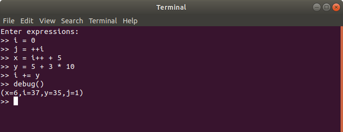
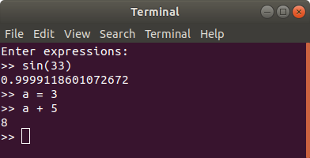
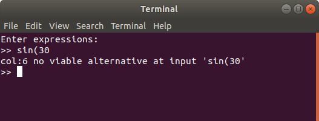

# Text Based Calculator

#### Objective: 
Implement a text based calculator application. Usage of Rhino, Nashorn and other
similar solutions is not allowed.
#### Input: 
The input is a series of assignment expressions. The syntax is a subset of Java numeric
expressions and operators.
Output: At the end of evaluating the series, the value of each variable is printed out.
#### Example:
Input: 

Following is a series of valid inputs for the program:

```java
i = 0
j = ++i
x = i++ + 5
y = 5 + 3 * 10
i += y
```
Output:

```java
(i=37,j=1,x=6,y=35)
```

## Design Goals:
1. Language specifications should be defined using [EBNF](https://en.wikipedia.org/wiki/Extended_Backus%E2%80%93Naur_form) and should encapsulate
   the arithmetics operator precedence in it's rules hierarchy.
2. Solution should have an [AST](https://en.wikipedia.org/wiki/Abstract_syntax_tree) (abstract syntax tree) layer that will be used to 
   represent the parsed text and evaluate/execute the arithmetic expressions. 
3. Language specification rules should be broken to corelate to the required AST
   structure. That will minimize transition code from parse rules to AST.
4. The AST model will also contain the arithmetic executing code which will
   enable to prevent conditional code and use object oriented to distinguish
   between the different operations.
   *  Example 1:
        ```
        2 + 2 is represented as a binary expression that holds the operator kind
        and left/right numeric expressions. When calling the evaluate method of
        the binary expression instance we will get a numeric expression of 4.
        ```
   * Example 2:
        ```
        a = 2 + 2 is represented as an assignment expression that has a variable
        expression as it's target and a binary expression as in example 1.
        When calling the execute method on the assignment expression the value will
        be evaluated as in the first example and the result will be stored in 
        the encapsulating process state.
        ```
5. The processing of the AST expression requires a state which should be passed
   in order to evaluate or execute and expression. The state is the actual values
   of the variables. This goal will be best served by having an instance created
   by the library user which will hold the state. 
   


## Implementation Details:
1. The project is based on maven. The maven project _pom.xml_ includes ANTLR as both a runtime    dependency that provides the base classes for the generated lexer/parse/visitor code. And a    development ANTLR dependency which is used as a maven plugin. The ANTLR maven plugin is        responsible for generating the lexer/parse/visitor code from the _Arithmetic.g4_ file.
2. To represent operator precedence rules where categorized into expressions, terms,
   factors and atoms. Precedence is defined as (1)atom (2)factors (3)terms and (4)expressions.
   See Arithmetic.g4 for complete language specification.
3. The translation between the parse rule tree and the abstract syntax tree
   will be named ExpressionBuilder and will be implemented based on a parse rule 
   tree visitor. 
   See ExpressionBuilder.java for implementation.
4. All known exceptions are thrown as _ProcessorException_. Parsing errors are handled by the
   _ExpressionBuilderErrorListner_ class and are routed to be thrown as a _ProcessorException_. In the current implementation only the first parsing error is thrown.
5. Every _Expression_ can either be evaluated or executed. Evaluating expressions does not        allow changing the processor state while executing does allow to change the processor          state. So expressions like `a=3` should be executed to actually change state. Executing an     expression like `sin(30)` will simply evaluate the expression. 
6. AST representation of the expressions is not returned in case of a parsing error to prevent    consistency issues. Instead the parsing error is raised as a _ProcessorException_. The         console implementation captures _ProcessorException_ exceptions and writes them to the user.
7. The grammar supports function expression such as `sin(2)`. Currently the implementation is     hard coded for the special methods `debug()` and `exit()` but all other function references    are executed using reflection on the _java.lang.Math_ class. Currently support is only         available for 0 to 2 arguments.
8. While the original goal was to create a simple calculator library the code is written to       provide for future development of solving equations. Thats is way evaluating an expression
   returns an Expression and not a primitive number. The code assumes that some expression will be reducible to primitive numbers. The current implementation treats variables that
   have not been declared as is they where declared and assigned to zero. This currently prevents the expressions to be non reducible.


## Usage:
Create a new processor and execute expressions:
```java
Processor processor = new Processor();
processor.execute("i = 0");
processor.execute("j = ++i");
processor.execute("x = i++ + 5");
processor.execute("y = 5 + 3 * 10");
processor.execute("i += y");
```

For testing purposes there is an API for validating variable value:
```java
assertTrue("'i' should be 37.", processor.checkVariable("i", 37));
```

Showing the state of the processor can be done using the debug method:
```java
System.out.println(processor.debug());
```

Evaluating an expression can by done using the evaluate method:
```java
Expression i = processor.evaluate("i");
if(i instanceof NumberExpression) {
        double value = ((NumberExpression)i).toValue();
} else {
        // Expression could not be reduced to a numeric value
}
```


## Console:

_Main.java_ implements a console interface to the library. The user is prompted to enter expressions. If the expression is executed and it can be evaluated, the used gets a response as in the case of running the _debug()_ expression which prints out the processor state. 



Evaluating expressions using the console:



Parsing errors displayed in the console:

